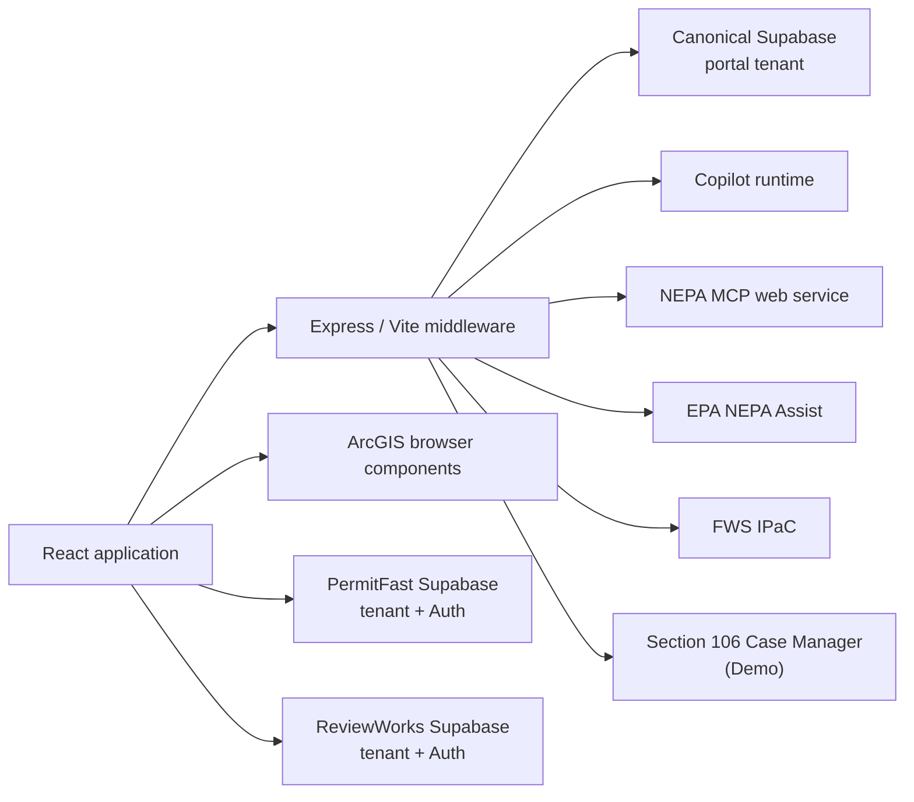
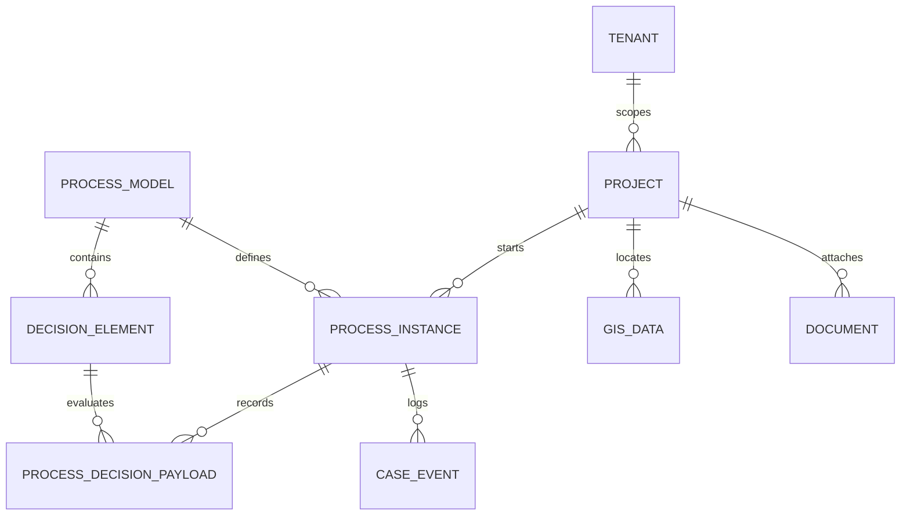

# Architecture and integration guide

## System overview

HelpPermitMe is a React single-page application backed by an Express server and one or more Supabase
projects. The application uses the CEQ/PIC-style entities as a shared vocabulary for portal and
cross-system workflows.

The canonical portal uses the same-origin `/api/supabase` proxy. PermitFast and ReviewWorks are
separate data domains and are accessed with their configured public credentials and authenticated
demo-user sessions. Tenant IDs scope reads and writes in all three Supabase domains.

## Frontend

- `src/App.tsx` defines the shared shell, navigation, redirects, and routes.
- `src/PortalPage.tsx` owns project intake, Copilot actions/readable context, auto-save,
  pre-screening, uploads, and reporting.
- `src/schema/projectSchema.ts` defines the RJSF project schema and helper metadata.
- `src/utils/projectPersistence.ts` maps portal state to projects, processes, decision payloads,
  case events, GIS data, and documents.
- `src/utils/permitflow.ts`, `reviewworks.ts`, and `section106.ts` implement connected workflows.
- `src/utils/geospatial.ts` normalizes geometry and upstream responses.
- `src/utils/permitInventory.ts`, `nepaAgencies.ts`, `agencyCaseMgmtTools.ts`, and
  `sharedServices.ts` provide static reference catalogs.

React Router deep links use an absolute Vite base and the production server falls back to
`dist/index.html`.

## Canonical data model

The portal's primary relationships are:

The seeded canonical process model is **Project Pre-screening**. Its decision elements capture core
project information, NEPA Assist and IPaC results, the permitting checklist, NEPA review data, and
supporting workflow state.

The portal stores linkage metadata in JSON fields so external records can be found without assuming
that project IDs are identical across systems. Older ID-based linkage is retained only as a
compatibility fallback.

## Save and pre-screening lifecycle

1. A new portal draft begins in browser state.
2. Auto-save or an explicit save creates/updates the canonical `project`, the pre-screening
   `process_instance`, GIS data, and case events.
3. The first save generates an eight-digit public-facing project identifier.
4. Geospatial screening calls same-origin server endpoints and retains normalized summaries and raw
   responses in portal state.
5. Saving or submitting pre-screening upserts decision payloads for the seeded decision elements.
6. Reports and supporting documents upload to `permit-documents` and create `document` records.
7. Project views reconstruct the state from canonical records and merge in linked external
   workflow status.

## Server routes

| Route | Responsibility |
| --- | --- |
| `/env.js` | Emits runtime-resolved browser configuration with `no-store` caching |
| `/api/supabase/*` | Proxies canonical Supabase REST and Storage requests with the configured anon key |
| `/api/copilotkit-runtime/*` | Proxies the configured Copilot runtime |
| `/api/custom-adk/*` | Proxies the Permitting ADK runtime and its agent entrypoint |
| `/api/nepa-mcp-runtime/*` | Adapts the NEPA service to the agent event protocol |
| `/api/nepa-mcp-query` | Runs a project-aware NEPA query |
| `/api/geospatial/environmental-map` | Requests an interactive environmental-map artifact |
| `/api/nepa-mcp-output/*` | Safely relays generated NEPA output files |
| `/api/geospatial/nepassist` | Normalizes and proxies NEPA Assist requests |
| `/api/geospatial/ipac` | Normalizes and proxies IPaC production/beta requests |
| `/api/section106/*` | Proxies the Section 106 exchange with its server-side key |

Development attaches the geospatial and Section 106 middleware through `vite.config.ts`. The full
Copilot, Supabase, NEPA, and static-file proxy stack is provided by `server.mjs`, so use a
production-style run when verifying those boundaries end to end.

## Copilot context and actions

The portal exposes bounded, human-readable and structured context for the current project,
geospatial results, permit inventory, and checklist. Registered actions can:

- update structured project fields;
- reset the form;
- add or update checklist items; and
- query the NEPA specialist with optional current-project context.

The Resource Check and Analytics pages expose their own page-specific readable context. The
Settings page switches between the default runtime and `/api/custom-adk/agent`; it does not change
the underlying persisted project data.

Copilot output is advisory. Application code remains responsible for schema normalization,
validation, and persistence.

## External workflow contracts

### PermitFast

The Right of Way Authorization integration targets the **Basic Permit (SF-299)** model. It looks up
the process model and schema-bearing decision elements, authenticates a user, creates or updates a
linked project/process, saves phased section payloads, uploads file fields, and submits the
application for approval.

Linkage uses `other._project_portal.source_project_id`. Location exchange includes GeoJSON and
screening summaries. See [the PermitFast handoff](../../PERMITFAST_HANDOFF.md) and
[geospatial handoff](../../PERMITFAST_HANDOFF_GEOSPATIAL.md).

### ReviewWorks

The Complex Review integration targets **Complex Environmental Review**, authenticates a demo user,
creates or updates a linked project/process, reads current status and case events, and contributes
to project and analytics views.

### IPaC

The geospatial proxy supports resource screening and beta project-location submission. The latter
returns an IPaC continuation URL. HelpPermitMe records local shadow process milestones; it does not
authenticate to Login.gov or complete the official consultation.

### Section 106

The demonstration exchange is server-proxied so the API key is not placed in browser JavaScript.
The portal keeps a local shadow process and linkage event, supports linkage recovery, reads stored
payloads and events, responds to proponent tasks, and can withdraw the demo case. See
[the Section 106 handoff](../../SECTION106_HANDOFF.md).

## Runtime configuration

Vite variables are compiled into development/build-time code. In production, `/env.js` provides
runtime values for the Copilot URL and Supabase domains, keys, and tenants. Resolution aliases are
documented in [the application guide](../README.md#environment-variables).

The canonical browser transport intentionally converts Supabase URLs to `/api/supabase` requests.
PermitFast and ReviewWorks clients use their own URLs because they also call the systems' Auth and
Storage endpoints.

## Security and productionization

Current safeguards include same-origin proxies for server-held integration credentials, tenant
filters in client queries, redaction of authorization headers from portal request logs, limited JSON
request bodies, and output-path traversal checks.

Those controls do not make this a production system. A production implementation must enforce
tenant and user authorization in database RLS and server middleware, validate all cross-system
payloads, protect destructive operations with real identity and roles, scan uploads, apply rate
limits and CSRF protections as appropriate, manage secrets centrally, and establish audit,
retention, privacy, accessibility, and incident-response practices.

## Testing boundaries

- Unit tests cover schema behavior, status logic, geospatial normalization, integration payload
  construction, and key UI controls.
- `npm run build` checks TypeScript projects and the production bundle.
- Playwright exercises auto-save, existing-project hydration, integrated checklist links, responsive
  status layout, project deletion, and Section 106 surfacing against configured services.

Because the end-to-end suite performs real writes and external cleanup, it must run only against
disposable demo/test tenants.
